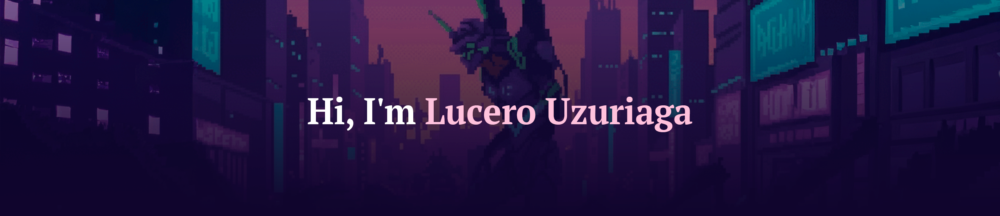

<div align="center">
  
  
  `---------------------------------------------------------------------------`
  ` [ SYSTEM_ACCESS: GRANTED ] [ UNIT_LUUZURIAGA: ONLINE ] `
  `---------------------------------------------------------------------------`
</div>

<h2 align="left">Hi 👋! My name is Lucero </h2>

Welcome to my terminal. I am a **Systems and Computer Engineering student** and **Full Stack Developer** dedicated to architecting high-performance web solutions. I have completed advanced technical specializations in full-stack software development, gaining deep proficiency in JavaScript, React, and server-side logic. My focus lies in the integration of RESTful APIs and database management to build scalable, functional, and highly efficient technical ecosystems.

---

```text
===========================================================================
[ TERMINAL ID: NERV-MAGI-01 ]          [ STATUS: SYNCHRONIZED ]
===========================================================================
> ACCESSING SUBJECT DATA...
> SUBJECT: LUCERO UZURIAGA
> FIELD: SYSTEMS AND COMPUTER ENGINEERING
> SPECIALIZATION: FULL STACK ARCHITECTURE
> LOCATION: LIMA, PERU
> STATUS: ACTIVE_RESEARCH_AND_DEVELOPMENT
===========================================================================
```


📊 NEURAL_SYNC_STATS (GitHub Analytics)
<div align="left">
  
  
</div>
<br>
🚀 ACTIVE_MISSIONS (Project Archives)

$ get-projects --featured
> 01. NEWS_EXPLORER_INITIATIVE: React / REST_API / UX-UI 
  [URL: [https://news-explorer-frontend-lac.vercel.app/](https://news-explorer-frontend-lac.vercel.app/)]

> 02. PROJECT_AROUND_THE_US: Node.js / Express / MongoDB / React
  [URL: [https://around-us-eta.vercel.app/](https://around-us-eta.vercel.app/)]

---

### 📟 ESTABLISH_CONNECTION // EXTERNAL_LINKS

<div align="left">
  <a href="https://www.linkedin.com/in/lucerouzuriaga/" target="_blank">
    
  </a>
  <a href="https://portfoliolu.vercel.app/" target="_blank">
    
  </a>
  <a href="mailto:lucero.uzuriaga2020@gmail.com">
    
  </a>
</div>

<br />

<div align="center">
  
  <br />
  
  <br />
  <code>[ SESSION_TERMINATED... BYE ]</code>
</div>
